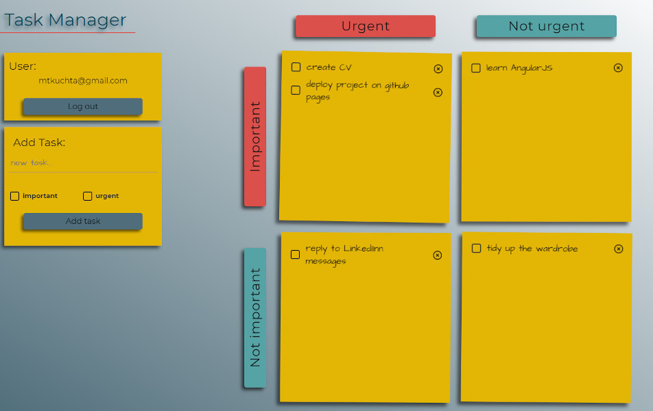

# TASK MANAGER



## Introduction

Simple application for task management based on the Eisenhower Matrix. You can define tasks and set attributes "important" and "urgent" for them.
Task board is divided into four sections depending on the attributes. You can drag task between sections to change task attributes.
To start using the application it is necessary to create an account. The Firebase is used for authentication and data storage.
The application is responsive only to 1200px. You can find Task Manager demo [here](https://mtkuchta.github.io/task-manager).

## Technologies:

- React 17.0.1,
- Redux 4.0.5,
- React Spring 8.0.27,
- Styled Components 5.2.1,
- Google Firebase,

## Setup

To run this project, install it locally using npm:

```
$ cd ../lorem
$ npm install
$ npm start
```

## Features

- create user account,
- log in user,
- add tasks with attributes "important" and "urgent",
- mark completed task,
- delete task,
- drag task between sections
